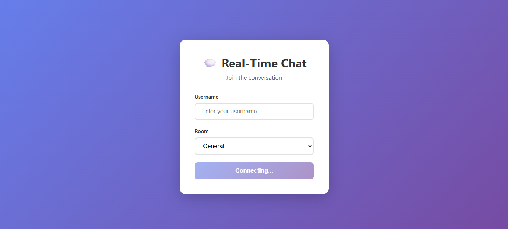
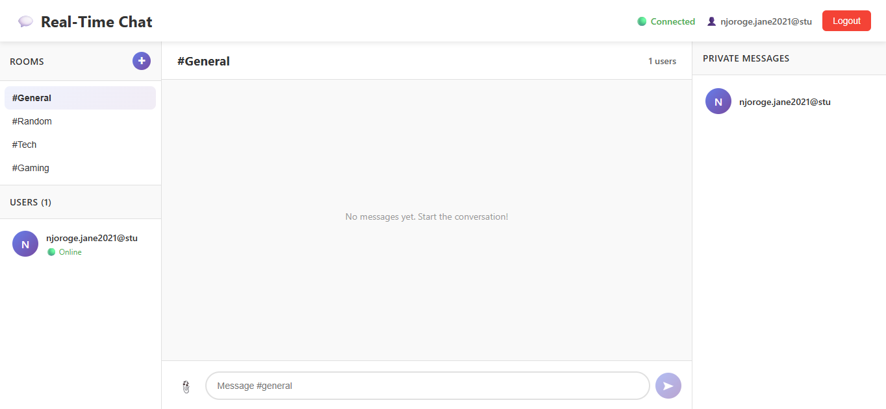

# Project Report

## Project Overview

This repository contains a Real-Time Chat Application built with React (Vite) on the frontend and Node.js + Express with Socket.io on the backend. The app demonstrates real-time, bidirectional communication features such as multiple chat rooms, private messaging, typing indicators, message reactions, read receipts, and basic file/image uploads.

The work was completed as part of a Deployment & DevOps week, with emphasis on preparing the project for production, adding deployment configuration, and documenting CI/CD and monitoring considerations.

## Project Structure

Top-level layout (important files and folders):

- `client/` — React front-end built with Vite
	- `index.html`, `package.json`, `vite.config.js`
	- `src/` — application source: `App.jsx`, `main.jsx`, `components/`, `pages/`, `context/`, `socket/`

- `server/` — Express + Socket.io back-end
	- `server.js` — main server file (Socket.io handlers and REST endpoints)
	- `package.json` — server dependencies and scripts
	- `uploads/` — runtime uploads directory (ignored by git)

- `.github/workflows/ci.yml` — basic CI workflow that installs deps and builds the client
- `Procfile` — simple process declaration to run the server on Heroku-style platforms
- `server/.env.example`, `client/.env.example` — environment variable templates
- `.gitignore` — ignores `node_modules`, env files, uploads, build outputs, and editor files

## Production Tools

The chosen production platforms for this project are:

- **Vercel** (frontend): optimized for static frontends built with Vite/React. Use Vercel to host the compiled client and configure the environment variable `VITE_SOCKET_URL` to point at the backend.

- **Render** (backend): a simple choice for deploying Node/Express services. Render provides automatic HTTPS, environment variable management, and automatic deployments from GitHub. Configure `MONGODB_URI`, `PORT`, and `ALLOWED_ORIGINS` in the Render dashboard.

Notes:
- You can also use alternatives (Heroku, Railway, Netlify) — the repo contains `Procfile` and CI config to help integration.

## Persistence and Database

The server supports configuring a MongoDB connection via environment variables (e.g., `MONGODB_URI`). If you provide a valid connection string and modify the server to use Mongoose models, the application will persist messages to MongoDB Atlas. Currently the server stores messages in memory; enabling the DB will provide persistence across restarts.

## CI/CD

A basic GitHub Actions workflow is included (`.github/workflows/ci.yml`) which installs dependencies and builds the client. For a complete CI/CD pipeline you should extend the workflow to:

- Run linting and unit tests
- Build server and client artifacts
- Run smoke/integration tests against a staging deployment
- Deploy to Render (backend) and Vercel (frontend) on successful builds

## Live Demo

- Frontend (Vercel):

---
### Screenshots

